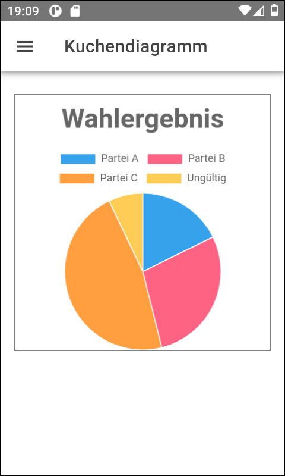
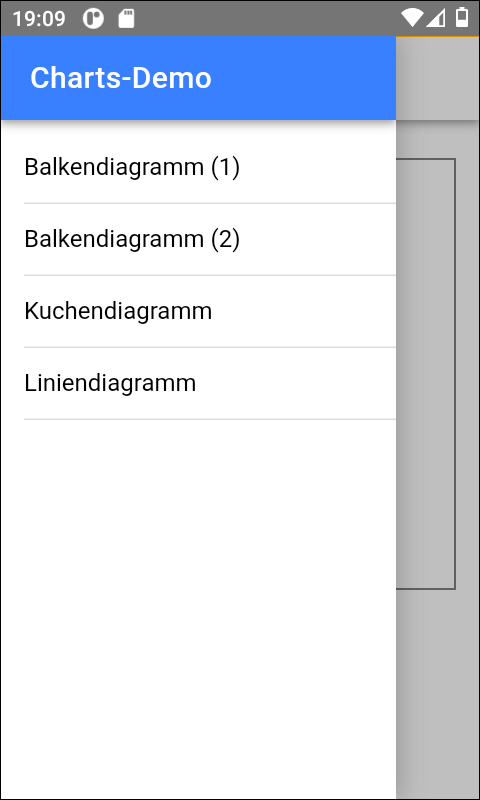

# Ionic-App mit Chart.js  #

 

Dieses Repository enthält eine [Ionic](https://ionicframework.com/)-App, die zeigt, wie man
[Charts.js](https://www.chartjs.org/) für Diagramme verwendet.

 

----

## Screenshots ##

 

 &nbsp; 

 

----

## License ##

 

See the [LICENSE file](LICENSE.md) for license rights and limitations (BSD 3-Clause License) for the files in this repository.

 
